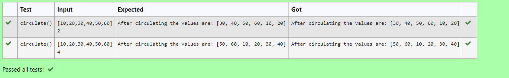

# Circulate-the-values-of-N-variables
## Aim:
To write a python program to circulate the n variables using function concept
## Equipment’s required:
PC
Anaconda - Python 3.7
## Algorithm: 
### Step 1: 
Import def circulate.


### Step 2: 
Prepare the lists from each linear equations and assign in np.array().


### Step 3: 
Get the value from the user for the number of rotation
### Step 4: 
Using the slicing concept rotate the list

### Step 5: 
Add coding to the input value.


### Step 6: 
Print the coding to get answer.


## Program:
```python
#Program to circulate N values.
#Developed by: S.S.SRIRAM
#RegisterNumber:22004880
def circulate():
    l=eval(input())
    n=int(input())
    l=l[n:]+l[:n]
    print("After circulating the values are:",l)
```

## Output:


## Result:
thus circulating the values of N variables using fusion concept successfully executed


